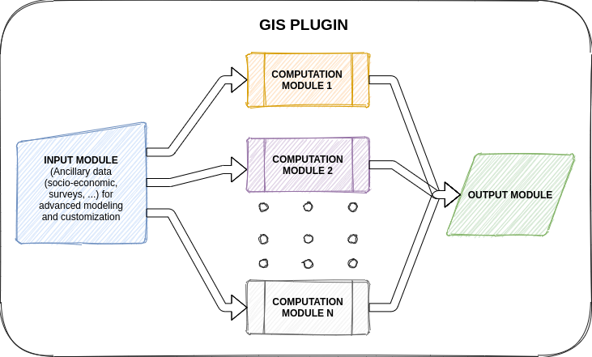

# oss-MISLAND-qgis
=======

QGIS plugin for OSS Land Degradation Monitoring Service (MISLAND)

### Plugin Modules

The offline system (GIS Plugin) will have three modules: 
- input module, 
- computation module and 
- output module. 

The input module will enable the user to load ancillary data, e.g. rainfall, vegetation cover, wind speed data etc., required by the service model to compute various outputs. 

The computation module will implement the models and algorithms, while the output module will enable the user to download the result. Our assumption here is that the output will be a Geotiff map for the area of interest.

It’s important to note that the same functions available through the web service will be available through a GIS plugin, where more advanced analysis can be done. This will overpass data sharing issues and allow users who do not have continuous/stable internet connection and want to perform advanced analysis 

---

### Plugin Flow

Below is an illustration of flow of information from one resource to another within the QGIS Plugin architecture

An end-user executes a module/script within the plugin eg. forest fires. The plugin sends this request to the backend API which creates an execution and execution logs for this instance as well as requests the script ID from the Postgresql database. The database returns metadata of the script back to the backend API which then sends the the request to [google earth engine](https://earthengine.google.com) python library on which script to run. Execution logs are then recorded in the database as the script runs from start to finish. 

On successful completion of the execution, the final result(tiff file) is exported by google earth engine to [Google Cloud Storage](https://earthengine.google.com) bucket as an object. The end-user is then able to thereafter download and visualize the result via the plugin onto QGIS. This data remains available for download by the end-user for upto 7 days. 

### Installation of stable version of plugin

Coming soon ...

---

### Installing plugin from a zipfile

Coming soon ...

---

### Documentation

Coming soon ...

---

### Getting help

Coming soon ...

---

### License

Coming soon ...
